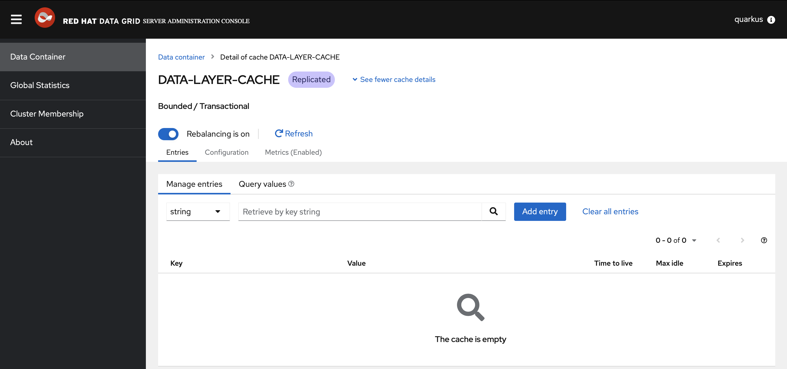
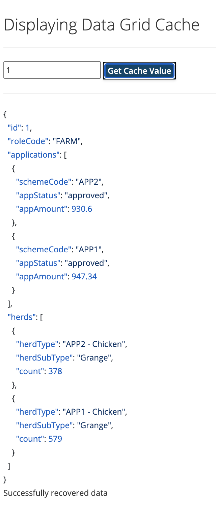
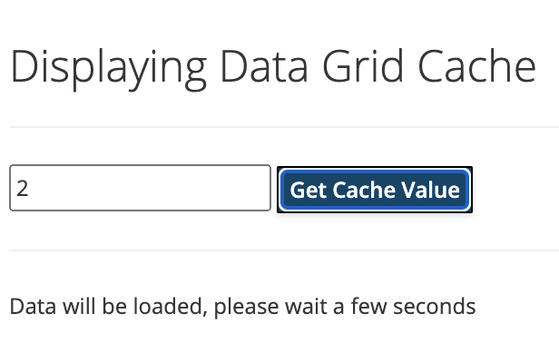
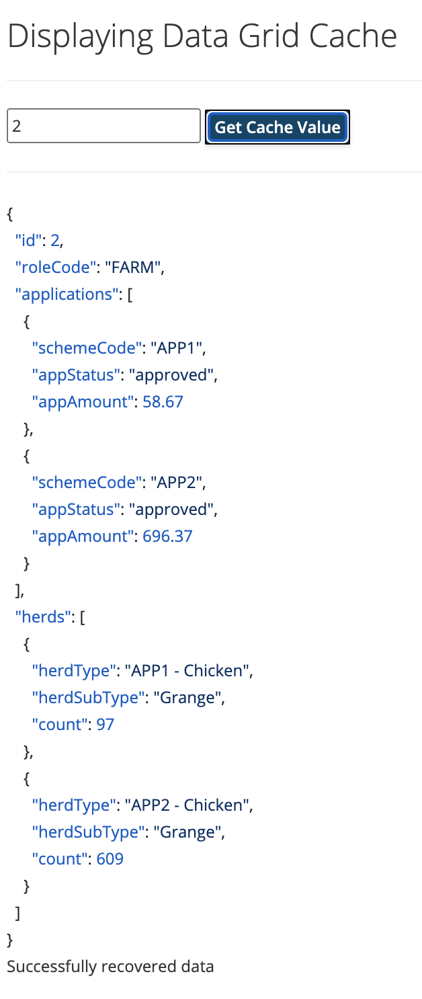
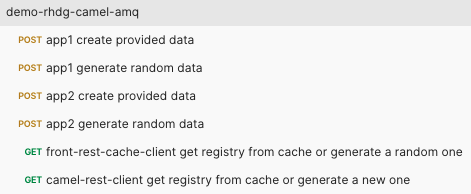
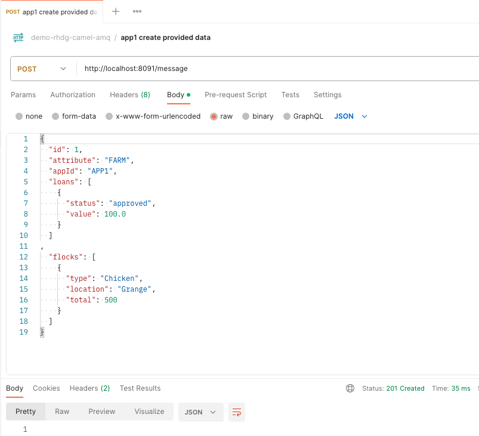
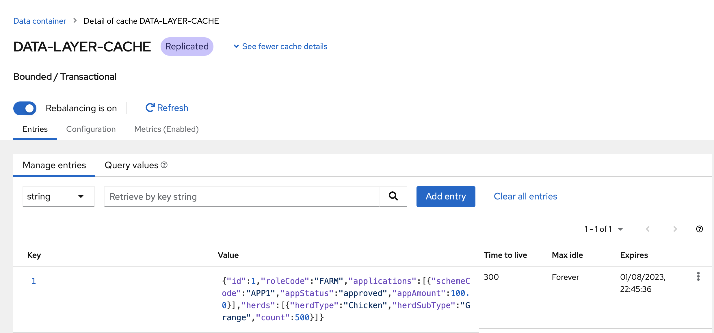
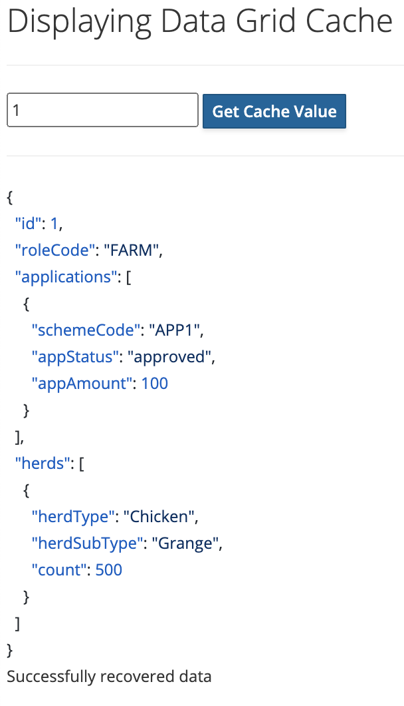

# Demo

This project demonstrates how to use [Red Hat AMQ](https://www.redhat.com/en/technologies/jboss-middleware/amq) + [Red Hat Data Grid](https://www.redhat.com/en/technologies/jboss-middleware/data-grid) and [Red Hat Build of Camel with Quarkus](https://access.redhat.com/documentation/en-us/red_hat_build_of_apache_camel_extensions_for_quarkus/) to create a data layer with a canonical data model.

<p align="center">
  
</p>

Below is a description of each component of the solution:

* **camel-amq-datagrid-common:**
  * Contains the canonical model of the data that will be available in the Data Grid. 
  * This project is shared between Camel transformation routes and Data Grid customers.
* **Transformation layer** 
  * **app1-camel-amq-datagrid**:
    * Responsible for receiving notifications about events generated by *app1* in the queue _APP1_DATA_RECORD_QUEUE_ and update the data in the Data Grid.
    * The route converts the model data known only by _App1_ in **json** format to the canonical model defined in camel-amq-datagrid-common.
    * Monitors topic _CACHE_UPDATE_REQUEST_ for cache refresh request. Triggers a REST API of the service *app1* requesting to add updated data to the message queue _APP1_DATA_RECORD_QUEUE_
  * **app2-camel-amq-datagrid**:
    * Responsible for receiving notifications about events generated by *app2* in the queue _APP2_DATA_RECORD_QUEUE_ and update the data in the Data Grid.
    * The route converts the model data known only by _App2_ in **xml** format to the canonical model defined in camel-amq-datagrid-common.
    * Monitors topic _CACHE_UPDATE_REQUEST_ for cache refresh request. Triggers a REST API of the service *app2* requesting to add updated data to the message queue _APP2_DATA_RECORD_QUEUE_
* **Access layer**
  * **front-rest-cache-client**:
    * Demonstrates how to consume data directly from the Data Grid and expose it through a REST API and an HTML interface. If the record is not found in the Data Grid, the application publishes a message in the _CACHE_UPDATE_REQUEST_ topic requesting that the applications publish data about the record in the AMQ MESSAGE BROKER and thus the Data Grid is updated.
    * Demonstrates how to configure and consume a Data Grid event listener to update the GUI in real time using [Server-Sent Events (SSE)](https://developer.mozilla.org/en-US/docs/Web/API/Server-sent_events/Using_server-sent_events)
    * Expose API in URL `http://localhost:8090/api`
  * **camel-rest-cache**:
    * Exposes the record query through a REST API simplifying access for clients that don't need to deal with connectivity to the Data Grid.
    * If the record is not found in the Data Grid, the application publishes a message in the _CACHE_UPDATE_REQUEST_ topic requesting that the applications publish data about the record in the AMQ MESSAGE BROKER and thus the Data Grid is updated.
    * Expose API in URL `http://localhost:8089/api`
  * **nodejs-rest-client**:
    * A simple client that consumes the API published by the _camel-rest-cache_ service and displays it through an HTML interface.
* **Producer layer**
  * **app1**: 
    * Represents an application with its particular data model. Publishes data changes to the _APP1_DATA_RECORD_QUEUE_ queue and receives notifications via REST API from _app1-camel-amq-datagrid_ camel route to provide data.
  * **app2**:
    * Represents an application with its particular data model. Publishes data changes to the _APP2_DATA_RECORD_QUEUE_ queue and receives notifications via REST API from _app2-camel-amq-datagrid_ camel route to provide data.

## Requirements
* JDK 17+
* Docker runtime 24+
* Docker Compose 2.19+
* NPM 9.5+
* Node 18+

> **Note**
> The examples below were run on a MacOS Ventura 13.4.1

> **Warning**
> Before running the commands below, check your platform configuration to support the above requirements.

## Run Separate

### Compile all projects
```shell
./mvnw clean install -DskipTests
```

### Start the infra services
```shell
docker compose down && docker compose up
```

### Execute the source applications (a fake source)
```shell
cd app1
./mvnw quarkus:dev -Ddebug=false

cd app2
./mvnw quarkus:dev -Ddebug=false
```

### Execute the First Integration layer
```shell
cd app1-camel-amq-datagrid
./mvnw quarkus:dev -Ddebug=false

cd app2-camel-amq-datagrid
./mvnw quarkus:dev -Ddebug=false
```

### Execute the second Integration layer
```shell
cd camel-rest-cache
./mvnw quarkus:dev -Ddebug=false
```

### Execute a custom app that can connect with datagrid and amq
```shell
cd front-rest-cache-client
./mvnw quarkus:dev -Ddebug=false
```

### Execute the view client for camel-rest-cache
```shell
cd front-nodejs-rest-client
npm install
node server.js
```

---

## Run with Docker compose

### Compile all projects
```shell
./mvnw clean install -Dskiptests
```

### Execute all projects
```shell
docker compose -f docker-compose-complete.yml down && docker compose -f docker-compose-complete.yml up --build
```

## Testing the solution

> **Note**
> Before running the tests it is necessary that all services are properly active, use the way you want above.

1. Access the _front-rest-cache-client_ service web interface `http://localhost:8090`

2. Access the _Data Grid_ admin console and navigate to the cache DATA-LAYER-CACHE page `http://localhost:11222/console/cache/DATA-LAYER-CACHE` **user:** _quarkus_ **password:** _password_

> **Warning**
> At first, the cache will be completely empty. In a productive environment it is necessary to decide if this is the expected behavior or if auxiliary services will be necessary to "warm up" the cache before the applications look for information in it.

> **Note**
> In this solution, the applications look for the registration key in the cache and if they don't find it, they start a process to populate the cache. In the case of the _front-rest-cache-client_ application, which is configured to listen to events from the Data Grid and has the capacity to receive events from the server, the interface is updated in real time.

3. Access the _front-nodejs-rest-client_ service web interface `http://localhost:3000`. *The interface is exactly the same as the **front-rest-cache-client** service*


4. In the _front-rest-cache-client_ interface, look for record **1**. Naturally, this value will not be found in the cache, so the service will send an update request by publishing a message in topic _CACHE_UPDATE_REQUEST_ in the AMQ Broker. 
> **Note** 
> We are talking about a **topic** and not a **queue**, as this update request must be answered by all applications that supply data to the canonical Data Grid model.

5. The first response will be something similar to the snippet below, indicating that an update process for the requested record has been initiated.
```json
{
    "type": "LOAD",
    "registry": null,
    "message": "Data will be loaded, please wait a few seconds"
}
```
> **Note**
> Depending on the speed of return, it is possible that the message is not even displayed.

6. A few seconds later, you will be able to see the interface update with a sample of randomly generated data


> **Note**
> In a real environment this data would possibly come from a database, for the sake of simplicity, both _app1_ and _app2_ make use of templates to generate examples with random data.

7. Go to _front-nodejs-rest-client_ interface and also search for key **1**, note that the return will be exactly the same.
8. Still in _front-nodejs-rest-client_, search for key 2. Note that the key was not found and the service only returns a message.

9. Repeating the query, this time it is possible to see the value generated by the apps _app1_ and _app2_


### Testing REST services

The project includes a [postman collection](/demo-rhdg-camel-amq.postman_collection.json) , you can import and use it to run the tests below.


10. Using the _"app1 create provided data"_ request, it is possible to publish an arbitrary data structure with the values you want in the _APP1_DATA_RECORD_QUEUE_ queue. (surely respecting the data model known by the camel route _app1-camel-amq-datagrid_).

11. Access the Data Grid administrative console and check that a new object in the cache was created with the indicated key (**id** field of the request body).


> **Note**
> Records in cache are configured to stay alive for a maximum of 5 minutes

12. Go to _front-rest-cache-client_ interface and also search for the same key, note that the return will be exactly the same.

13. using the _"app2 create provided data"_ request, add information referring to the data provided by _app2_ to the same key. In app2 the data model is based on xml.

14. Notice in the _front-rest-cache-client_ interface that the data has been enriched and now contains information from both applications.

15. Both _"app1 generate random data"_ and _"app2 generate random data"_ requests generate template-based data with random values. The last part of the URL represents the path parameter that defines the value of the key that will be used in the Data Grid. `http://localhost:8091/message/random/1` and `http://localhost:8092/message/random/1` 

> **Note**
> These are exactly the same services invoked when using some interface to fetch a key that does not exist in the cache.


