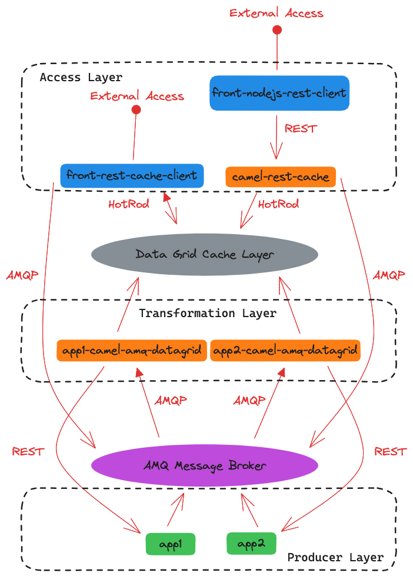

# Demo

This project demonstrates how to use [Red Hat AMQ](https://www.redhat.com/en/technologies/jboss-middleware/amq) + [Red Hat Data Grid](https://www.redhat.com/en/technologies/jboss-middleware/data-grid) and [Red Hat Build of Camel with Quarkus](https://access.redhat.com/documentation/en-us/red_hat_build_of_apache_camel_extensions_for_quarkus/) to create a data layer with a canonical data model.

<div style="text-align: center;">
  
</div>

Below is a description of each component of the solution:

* **camel-amq-datagrid-common:**
  * Contains the canonical model of the data that will be available in the Data Grid. 
  * This project is shared between Camel transformation routes and Data Grid customers.
* **Transformation layer** 
  * **app1-camel-amq-datagrid**:
    * Responsible for receiving notifications about events generated by *App1* in the queue _APP1_DATA_RECORD_QUEUE_ and update the data in the Data Grid.
    * The route converts the model data known only by _App1_ in **json** format to the canonical model defined in camel-amq-datagrid-common.
  * **app2-camel-amq-datagrid**:
    * Responsible for receiving notifications about events generated by *App2* in the queue _APP2_DATA_RECORD_QUEUE_ and update the data in the Data Grid.
    * The route converts the model data known only by _App2_ in **xml** format to the canonical model defined in camel-amq-datagrid-common.
* **Access layer**
  * **app-cache-client**:
    * Demonstrates how to consume data directly from the Data Grid and expose it through a REST API and an HTML interface. If the record is not found in the Data Grid, the application publishes a message in the _CACHE_UPDATE_REQUEST_ topic requesting that the applications publish data about the record in the AMQ MESSAGE BROKER and thus the Data Grid is updated.
    * Demonstrates how to configure and consume a Data Grid event listener to update the GUI in real time using [Server-Sent Events (SSE)](https://developer.mozilla.org/en-US/docs/Web/API/Server-sent_events/Using_server-sent_events)
  * **camel-rest-cache**:
    * Exposes the record query through a REST API simplifying access for clients that don't need to deal with connectivity to the Data Grid.
    * If the record is not found in the Data Grid, the application publishes a message in the _CACHE_UPDATE_REQUEST_ topic requesting that the applications publish data about the record in the AMQ MESSAGE BROKER and thus the Data Grid is updated.

## Requirements
* JDK 17+
* Docker runtime 24+
* Docker Compose 2.19+
* NPM 9.5+
* Node 18+

> **Note**
> The examples below were run on a MacOS Ventura 13.4.1

> **Warning**
> Before running the commands below, check your platform configuration to support the above requirements.

## Run Separate

### Compile all projects
```shell
./mvnw clean install -DskipTests
```

### Start the infra services
```shell
docker compose down && docker compose up
```

### Execute the Generator client (a fake source)
```shell
cd amq-client
./mvnw quarkus:dev -Ddebug=false
```

### Execute the First Integration layer
```shell
cd app1-camel-amq-datagrid
./mvnw quarkus:dev -Ddebug=false

cd app2-camel-amq-datagrid
./mvnw quarkus:dev -Ddebug=false
```

### Execute the second Integration layer
```shell
cd camel-rest-cache
./mvnw quarkus:dev -Ddebug=false
```

### Execute a custom app that can connect with datagrid and amq
```shell
cd app-cache-client
./mvnw quarkus:dev -Ddebug=false
```

### Execute the view client for camel-rest-cache
```shell
cd nodejs-rest-client
npm install
node server.js
```

---

## Run with Docker compose

### Compile all projects
```shell
./mvnw clean install -Dskiptests
```

### Execute all projects
```shell
docker compose -f docker-compose-complete.yml down && docker compose -f docker-compose-complete.yml up --build
```
